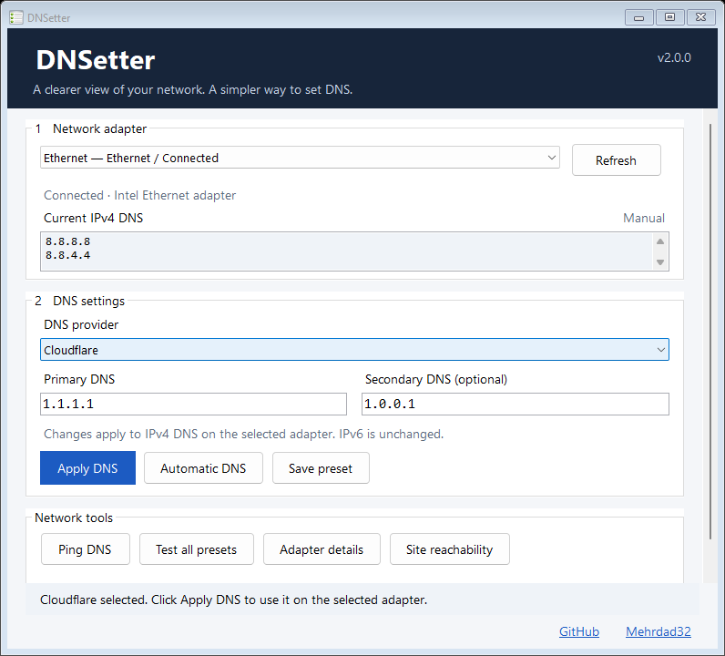
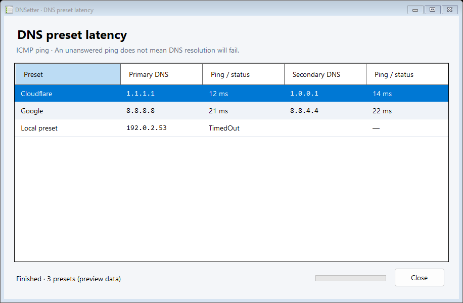

# DNSetter

[English](README.en.md) · [دانلود نسخهٔ ۲](https://github.com/Mehrdad32/DNSetter/releases/tag/v2.0.0) · [گزارش مشکل](https://github.com/Mehrdad32/DNSetter/issues/new/choose)

[](https://github.com/Mehrdad32/DNSetter/actions/workflows/core-ci.yml)
[](https://github.com/Mehrdad32/DNSetter/releases/latest)
[](LICENSE)

**DNSetter** برنامه‌ای قابل‌حمل برای ویندوز است که DNS کارت شبکهٔ انتخاب‌شده را نمایش می‌دهد، DNSهای دلخواه را ذخیره و تست می‌کند و تنظیمات **IPv4 DNS** همان کارت را تغییر می‌دهد.



*تصویر از خود برنامه با دادهٔ شبکهٔ نمونه گرفته شده است.*

## دانلود و اجرا

نسخهٔ پایدار: **2.0.0** — برای Windows 10 / 11، بدون نیاز به نصب جداگانهٔ .NET.

| سیستم | دانلود |
| --- | --- |
| ویندوز ۶۴ بیتی | [DNSetter-win-x64.zip](https://github.com/Mehrdad32/DNSetter/releases/download/v2.0.0/DNSetter-win-x64.zip) |
| ویندوز ۳۲ بیتی | [DNSetter-win-x86.zip](https://github.com/Mehrdad32/DNSetter/releases/download/v2.0.0/DNSetter-win-x86.zip) |
| بررسی صحت فایل‌ها | [SHA256SUMS.txt](https://github.com/Mehrdad32/DNSetter/releases/download/v2.0.0/SHA256SUMS.txt) |

ZIP مناسب سیستم را در پوشه‌ای با امکان نوشتن استخراج کن و `DNSetter.exe` را اجرا کن. برنامه برای تغییر DNS درخواست **Administrator** می‌کند. فهرست شخصی DNS در `list.json` کنار برنامه ذخیره می‌شود؛ هنگام ارتقا این فایل را نگه دار.

## استفاده

1. کارت شبکهٔ موردنظر را انتخاب کن. اگر چند کارت متصل باشد، انتخاب با خودت است.
2. DNS فعلی را در بخش **Current IPv4 DNS** ببین. از فهرست یک preset انتخاب کن یا آدرس دلخواه وارد کن؛ آدرس اول الزامی و آدرس دوم اختیاری است.
3. **Apply DNS** را بزن. برنامه تغییر را روی همان کارت اعمال و نتیجه را دوباره از ویندوز بررسی می‌کند.
4. برای دریافت خودکار DNS، **Automatic DNS** را بزن.

**Automatic DNS تنظیم دستی قبلی را بازیابی نمی‌کند؛ DNS همان کارت را به حالت خودکار (DHCP) می‌برد.** اگر قبل از تغییر DNS دستی داشتی، برای بازگشت به آن آدرس‌های قبلی را دوباره وارد و Apply کن. در صورت شکست عملیات، برنامه تلاش می‌کند تنظیمات پیش از همان عملیات را برگرداند.

## دکمه‌ها چه می‌کنند؟

| دکمه | رفتار |
| --- | --- |
| Refresh | بازخوانی فهرست کارت‌ها و DNS کارت انتخاب‌شده |
| Apply DNS | اعمال یک یا دو IPv4 DNS معتبر روی کارت متصل انتخاب‌شده، بررسی نتیجه و پاک‌سازی کش DNS |
| Automatic DNS | تنظیم IPv4 DNS همان کارت روی حالت خودکار |
| Save preset | ذخیره یا به‌روزرسانی ورودی‌ها در `list.json`؛ تنظیم شبکه را تغییر نمی‌دهد |
| Ping DNS | تست ICMP آدرس‌های واردشده و نمایش زمان یا وضعیت پاسخ |
| Test all presets | تست موازی presetها با جدول نتایج و پیشرفت؛ بستن پنجره ادامهٔ تست را لغو می‌کند |
| Adapter details | نمایش شناسه، index، تنظیم DNS و آدرس‌های مؤثر IPv4/IPv6 همان کارت |
| Site reachability | بررسی پاسخ HTTPS سایت Gemini با تنظیمات شبکه و proxy ویندوز |



*نتایج تصویر نمونه هستند و معیار مقایسهٔ سرویس‌های DNS نیستند.*

## محدودهٔ عملکرد

- فقط **IPv4 DNS کارت انتخاب‌شده** نوشته می‌شود. تنظیم IP، Gateway، کارت‌های دیگر و DNS IPv6 تغییر نمی‌کند.
- **Ping تست DNS resolution نیست.** یک سرویس ممکن است به ICMP پاسخ ندهد ولی DNS آن کار کند.
- تست سایت وضعیت HTTP را گزارش می‌کند؛ تأیید عبور از فیلترینگ یا محدودیت جغرافیایی نیست.
- مرورگر دارای Secure DNS / DoH، VPN یا سیاست‌های شبکه ممکن است از DNS دیگری استفاده کند.
- بازگشت خودکار برای عملیات ناموفق انجام می‌شود؛ سابقهٔ دائمی برای بازیابی پس از خاموش‌شدن یا توقف اجباری برنامه وجود ندارد.

## رفع مشکل

| وضعیت | بررسی |
| --- | --- |
| Apply غیرفعال است | کارت متصل را انتخاب کن و در کادر اول یک IPv4 معتبر وارد کن |
| کارت شبکه نمایش داده نمی‌شود | اتصال را بررسی و Refresh کن؛ فقط کارت‌های دارای پشتیبانی IPv4 فهرست می‌شوند |
| خطای دسترسی هنگام تغییر DNS | برنامه را با دسترسی Administrator اجرا کن |
| ذخیرهٔ preset شکست می‌خورد | برنامه را به پوشه‌ای منتقل کن که اجازهٔ نوشتن `list.json` در آن داری |
| Ping پاسخ نمی‌گیرد | نتیجه فقط دربارهٔ ICMP است؛ شبکه یا سرویس ممکن است آن را مسدود کند |
| Automatic آدرس DNS نشان نمی‌دهد | دریافت DNS خودکار به تنظیمات شبکه/DHCP وابسته است؛ روی IP ثابت ممکن است سروری دریافت نشود |

برای گزارش مشکل، نسخهٔ برنامه، نسخهٔ ویندوز، معماری x64/x86، مراحل بازتولید و متن کامل خطا را در [Issues](https://github.com/Mehrdad32/DNSetter/issues) بنویس.

## توسعه و تست

برنامه با **C#، .NET 8 و Windows Forms** ساخته شده است. Core از رابط کاربری و اجرای فرمان‌های ویندوز جداست.

```powershell
dotnet build DNSetter.sln -c Release
dotnet run --project tests/DNSetter.Core.Tests/DNSetter.Core.Tests.csproj -c Release
```

برای ساخت کامل به ویندوز و .NET 8 SDK نیاز داری. تست‌های Core روی ویندوز و لینوکس اجرا می‌شوند و هیچ تنظیم واقعی شبکه‌ای را تغییر نمی‌دهند. runner این تست‌ها با `dotnet run` اجرا می‌شود.

[راهنمای مشارکت و ساخت خروجی](CONTRIBUTING.md) · [راهنمای تست ویندوز](docs/testing.fa.md) · [تغییرات نسخه‌ها](CHANGELOG.md)

## مجوز

کد پروژه با مجوز [MIT](LICENSE) منتشر شده است.
